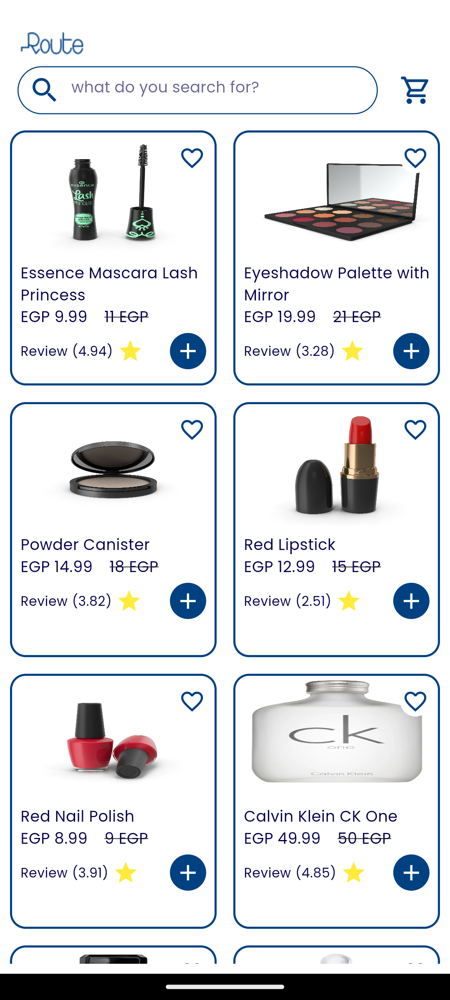
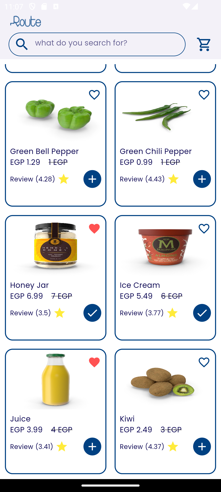

# Route Task Flutter App

A Flutter project showcasing a product listing app with a clean UI, BLoC architecture for state management, and network interactions.

## Features

- **Product Listing:** Displays a grid of products with image, title, price, discounts, ratings, and actions (add to cart, favorites).
- **BLoC Architecture:** Implements Business Logic Component (BLoC) pattern for organized state management and reactive UI updates.
- **Network Calls:** Fetches product data from a remote source using Dio and handles errors gracefully.
- **Caching:** Uses `cached_network_image` to optimize image loading and improve performance.
- **Responsive Design:**  Utilizes `flutter_screenutil` for a consistent UI experience across different screen sizes.

## Screenshots

*Image of Product List Screen*

*Image of Favourite and add to cart actions*

## Getting Started

**Prerequisites**

- Flutter SDK (>=3.3.4 <4.0.0)
- Android Studio or Visual Studio Code

**Installation**

1. Clone this repository.
2. Run `flutter pub get` to install dependencies.
3. Run the app on an emulator or physical device.
